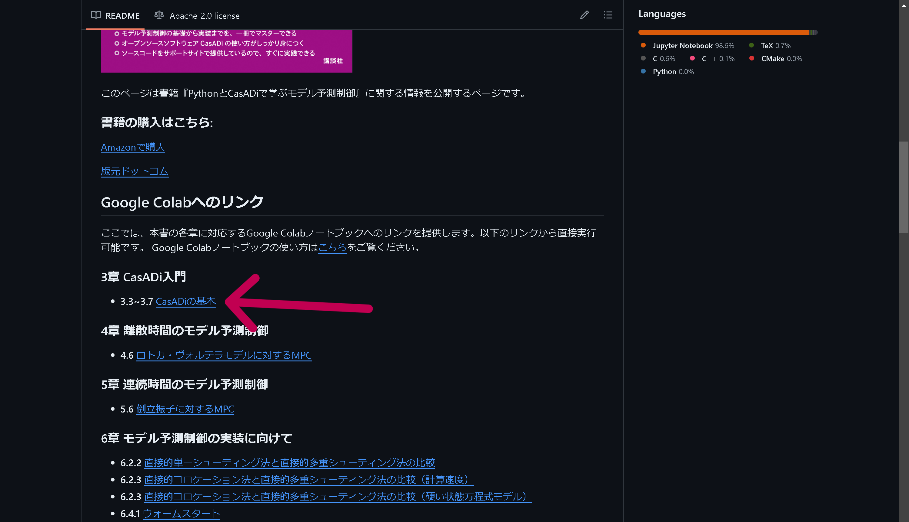
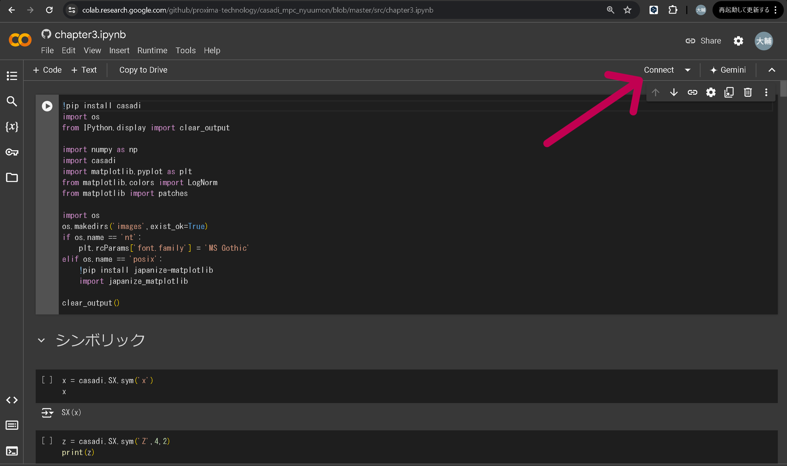
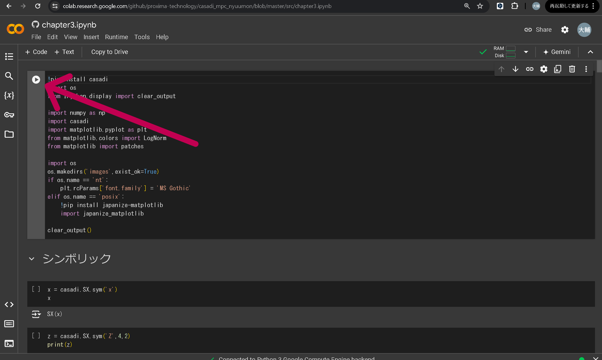
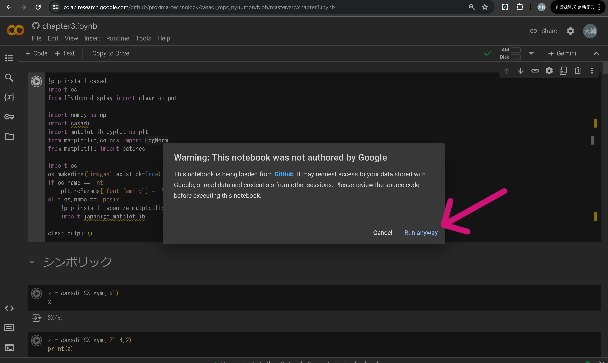
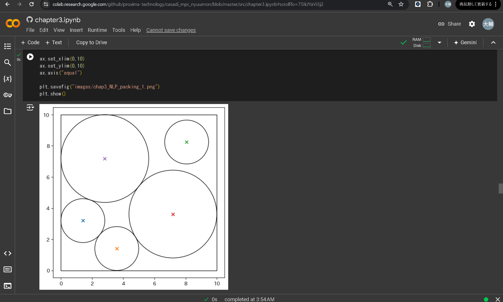

# Google Colabノートブックの使い方

## 前提  

Gmailアドレスを事前に取得し、Googleアカウントにログインした状態にします。

## 1. Google Colabノートブック一覧の表示

以下のリンクをクリックしてGoogle Colabノートブック一覧を表示します。

[Google Colabノートブック一覧](https://github.com/proxima-technology/casadi_mpc_nyuumon#google-colab%E3%81%B8%E3%81%AE%E3%83%AA%E3%83%B3%E3%82%AF)

コントロールキーを押しながらリンクをクリックすると別タブで開くことができます。

## 2. 実行したいGoogle Colabノートブックの選択

実行したいGoogle Colabノートブックのリンクをクリックします。

 

 

以下では「chapter3.ipynb」（[CasADiの基本](https://colab.research.google.com/github/proxima-technology/casadi_mpc_nyuumon/blob/master/src/chapter3.ipynb)）を選択しています。

## 3.  Google Colabの起動

画面右上の**Connect**（接続）をクリックします。

 

 

## 4.1  セルの個別実行

この状態で、「Shift + Enter」(Shift を押しながら Enter を押す)を入力すると、選択されたセルが 実行されます。

 

 

## 4.2  すべてのセルの実行

あるいは、メニューから**Runtime**（「ランタイム」）から**Run All**（「すべてのセルを実行」）をクリックすると、すべてのセルを同時に実行することもできます。

 

 

## 5. 注意

最初の実行の際に以下のような注意が出た場合は**Run Anyway**をクリックします。

 

 

## 6.  セルの実行の様子

起動を行うと、最初のセルの実行が始まり、次のような画面が表示されます。

 

 

中盤あたりで次のような画面が表示されていれば、問題ないでしょう。

 

 

[メインページに戻る](readme.md)
