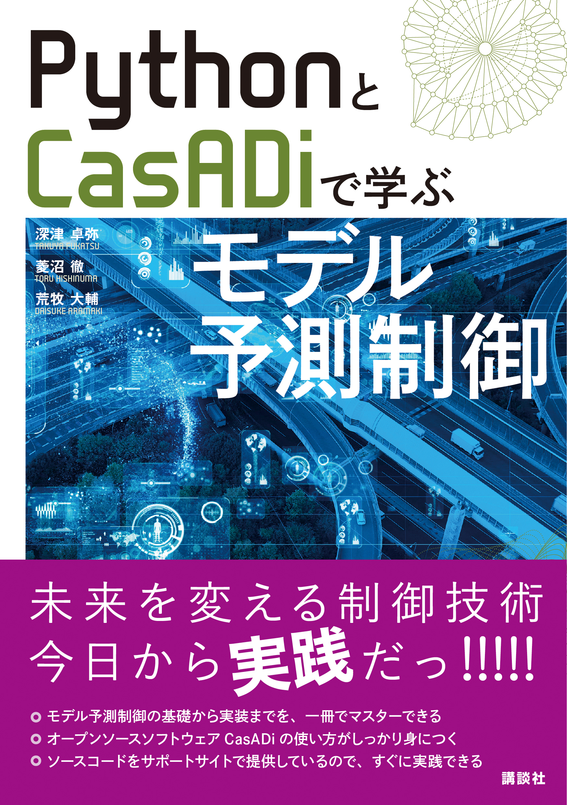

# PythonとCasADiで学ぶモデル予測制御
このページは書籍「PythonとCasADiで学ぶモデル予測制御」に関する情報を公開するページです。

## Google Colabへのリンク

* 3章 CasADi入門
  * [CasADiの基本](https://colab.research.google.com/github/proxima-technology/casadi_mpc_nyuumon/blob/master/src/chapter3.ipynb)
* 4章 離散時間のモデル予測制御
  * [ロトカ・ヴォルテラモデルに対するMPC](https://colab.research.google.com/github/proxima-technology/casadi_mpc_nyuumon/blob/master/src/chapter4.ipynb)
* 5章 連続時間のモデル予測制御
  * [倒立振子に対するMPC](https://colab.research.google.com/github/proxima-technology/casadi_mpc_nyuumon/blob/master/src/chapter5.ipynb)
* 6章 MPCの実装に向けて
  * [6章 直接的単一シューティング法と直接的多重シューティング法の比較](https://colab.research.google.com/github/proxima-technology/casadi_mpc_nyuumon/blob/master/src/chapter6_single_shooting.ipynb)
  * [6章 直接的コロケーション法と直接的多重シューティング法の比較（計算速度）](https://colab.research.google.com/github/proxima-technology/casadi_mpc_nyuumon/blob/master/src/chapter6_collocation_cartpole.ipynb)
  * [6章 直接的コロケーション法と直接的多重シューティング法の比較（硬い状態方程式モデル）](https://colab.research.google.com/github/proxima-technology/casadi_mpc_nyuumon/blob/master/src/chapter6_collocation_stiff.ipynb)
  * [6章 ウォームスタート](https://colab.research.google.com/github/proxima-technology/casadi_mpc_nyuumon/blob/master/src/chapter6_warm_start_experiment_solution_time.ipynb)
  * [6章 反復回数の制限](https://colab.research.google.com/github/proxima-technology/casadi_mpc_nyuumon/blob/master/src/chapter6_limit_iteration.ipynb)
* 7章 CasADiにおける最適化ソルバーの比較
  * [7章 マス・バネ・ダンバモデルを例に用いたIPOPTとOSQPの比較](https://colab.research.google.com/github/proxima-technology/casadi_mpc_nyuumon/blob/master/src/chapter7_QP_example.ipynb)
  * [7章 2次元ドローンを例に用いたQPソルバーの比較](https://colab.research.google.com/github/proxima-technology/casadi_mpc_nyuumon/blob/master/src/chapter7_2d_quadrotor.ipynb)
  * [7章 ゴム紐モデルを例に用いたNLPソルバーの比較](https://colab.research.google.com/github/proxima-technology/casadi_mpc_nyuumon/blob/master/src/chapter7_chain_of_masses.ipynb)
* 8章 状態推定問題と移動ホライズン推定
  * [8章 リチウムイオン電池に対するMHE](https://colab.research.google.com/github/proxima-technology/casadi_mpc_nyuumon/blob/master/src/chapter8_MHE.ipynb)
  * [8章 CSTRに対するMPCxMHE](https://colab.research.google.com/github/proxima-technology/casadi_mpc_nyuumon/blob/master/src/chapter8_MPC_and_MHE.ipynb)
* B章 CasADi中級
  * [B章 acados（* Google Colabでの動作は行えません。）](https://colab.research.google.com/github/proxima-technology/casadi_mpc_nyuumon/blob/master/src/chapterB_acados_getting_started.ipynb)
  * [B章 codegen for func](https://colab.research.google.com/github/proxima-technology/casadi_mpc_nyuumon/blob/master/src/chapterB_codegen_function_object.ipynb)
  * [B章 codegen for solver](https://colab.research.google.com/github/proxima-technology/casadi_mpc_nyuumon/blob/master/src/chapterB_codegen_solver_interface.ipynb)
  * [B章 discrete](https://colab.research.google.com/github/proxima-technology/casadi_mpc_nyuumon/blob/master/src/chapterB_discrete_actuator.ipynb)
