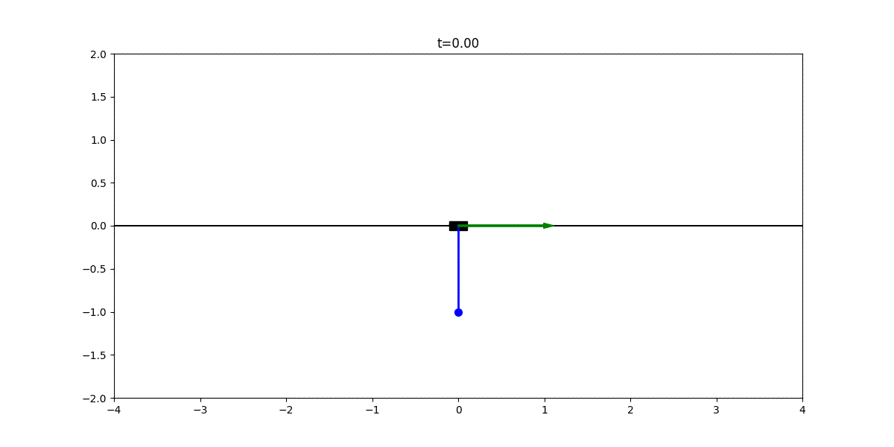
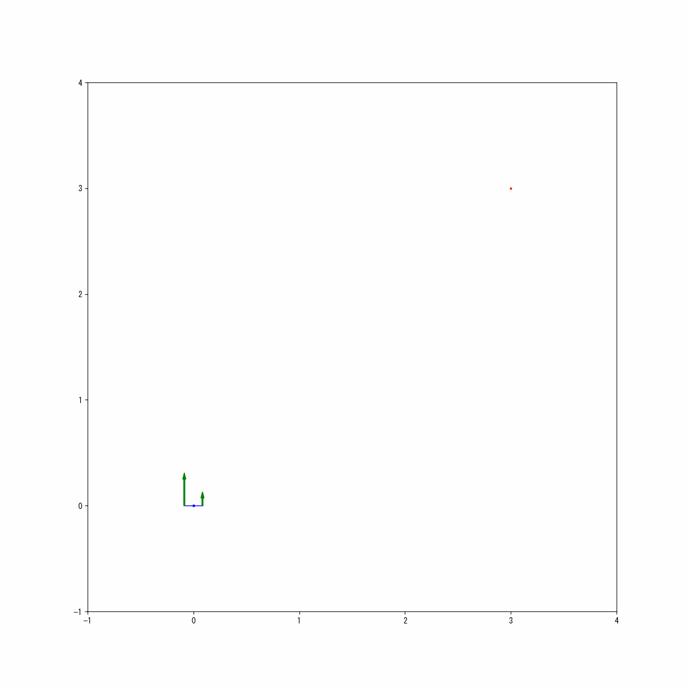
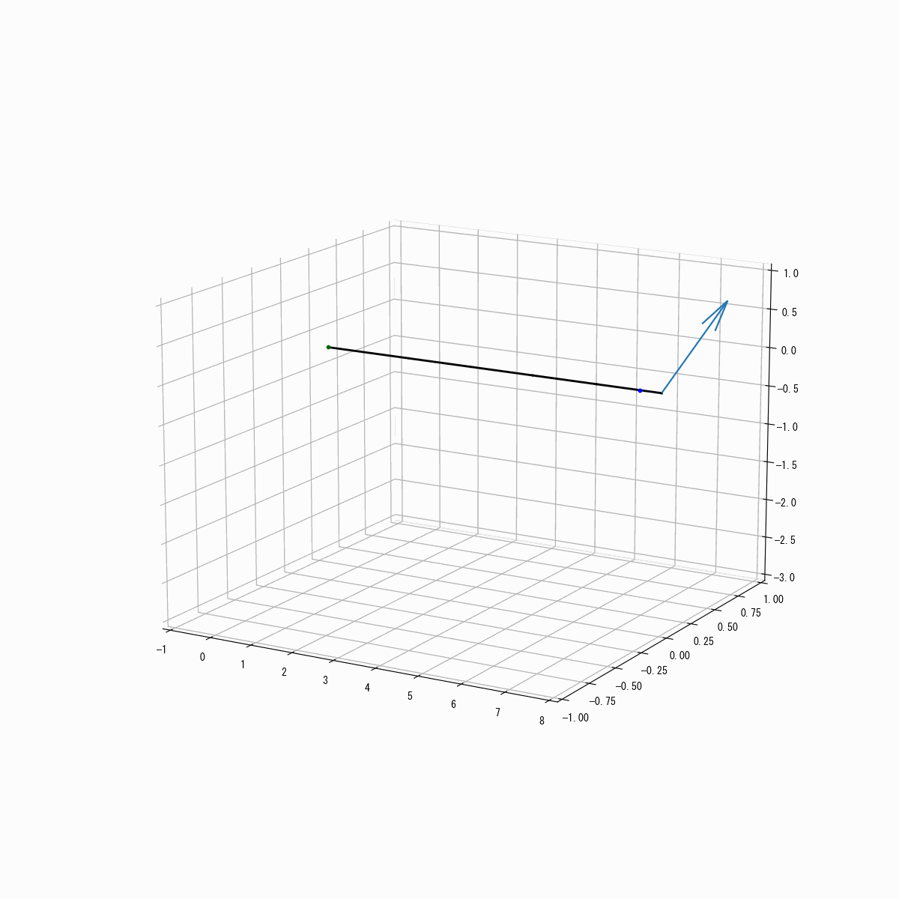

# 書籍『PythonとCasADiで学ぶモデル予測制御』サポートサイト

このページは書籍『PythonとCasADiで学ぶモデル予測制御』に関する情報を公開するページです。

### 書籍の購入はこちら:
[Amazonで購入](https://amzn.asia/d/8TwVTO3)

[版元ドットコム](https://www.hanmoto.com/bd/isbn/9784065356111)

## Google Colabへのリンク
ここでは、本書の各章に対応するGoogle Colabノートブックへのリンクを提供します。以下のリンクから直接実行可能です。
Google Colabノートブックの使い方は[こちら](how_to_run.md)をご覧ください。

### 3章 CasADi入門
- **3.3~3.7** [CasADiの基本](https://colab.research.google.com/github/proxima-technology/casadi_mpc_nyuumon/blob/master/src/chapter3.ipynb)

### 4章 離散時間のモデル予測制御
- **4.6** [ロトカ・ヴォルテラモデルに対するMPC](https://colab.research.google.com/github/proxima-technology/casadi_mpc_nyuumon/blob/master/src/chapter4.ipynb)

### 5章 連続時間のモデル予測制御
- **5.6** [倒立振子に対するMPC](https://colab.research.google.com/github/proxima-technology/casadi_mpc_nyuumon/blob/master/src/chapter5.ipynb)

### 6章 モデル予測制御の実装に向けて
- **6.2.2** [直接的単一シューティング法と直接的多重シューティング法の比較](https://colab.research.google.com/github/proxima-technology/casadi_mpc_nyuumon/blob/master/src/chapter6_single_shooting.ipynb)
- **6.2.3** [直接的コロケーション法と直接的多重シューティング法の比較（計算速度）](https://colab.research.google.com/github/proxima-technology/casadi_mpc_nyuumon/blob/master/src/chapter6_collocation_cartpole.ipynb)
- **6.2.3** [直接的コロケーション法と直接的多重シューティング法の比較（硬い状態方程式モデル）](https://colab.research.google.com/github/proxima-technology/casadi_mpc_nyuumon/blob/master/src/chapter6_collocation_stiff.ipynb)
- **6.4.1** [ウォームスタート](https://colab.research.google.com/github/proxima-technology/casadi_mpc_nyuumon/blob/master/src/chapter6_warm_start_experiment_solution_time.ipynb)
- **6.4.1** [反復回数の制限](https://colab.research.google.com/github/proxima-technology/casadi_mpc_nyuumon/blob/master/src/chapter6_limit_iteration.ipynb)

### 7章 CasADiにおける最適化ソルバーの比較
- **7.2** [マス・バネ・ダンバモデルを例に用いたIPOPTとOSQPの比較](https://colab.research.google.com/github/proxima-technology/casadi_mpc_nyuumon/blob/master/src/chapter7_mass_spring_damper.ipynb)
- **7.3** [2次元ドローンを例に用いたQPソルバーの比較](https://colab.research.google.com/github/proxima-technology/casadi_mpc_nyuumon/blob/master/src/chapter7_2d_quadrotor.ipynb)
- **7.4** [ゴム紐モデルを例に用いたNLPソルバーの比較](https://colab.research.google.com/github/proxima-technology/casadi_mpc_nyuumon/blob/master/src/chapter7_chain_of_masses.ipynb)

### 8章 状態推定問題と移動ホライズン推定
- **8.4** [リチウムイオン電池に対するMHE](https://colab.research.google.com/github/proxima-technology/casadi_mpc_nyuumon/blob/master/src/chapter8_LIB.ipynb)
- **8.5** [CSTRに対するMPCxMHE](https://colab.research.google.com/github/proxima-technology/casadi_mpc_nyuumon/blob/master/src/chapter8_CSTR.ipynb)

### B章 CasADi中級
- **B.2.2** [関数オブジェクトのCコード生成](https://colab.research.google.com/github/proxima-technology/casadi_mpc_nyuumon/blob/master/src/chapterB_codegen_function_object.ipynb)
- **B.2.3** [ソルバーオブジェクトのCコード生成](https://colab.research.google.com/github/proxima-technology/casadi_mpc_nyuumon/blob/master/src/chapterB_codegen_solver_interface.ipynb)
- **B.4** [acados（* Google Colabでの動作は行えません。）](https://colab.research.google.com/github/proxima-technology/casadi_mpc_nyuumon/blob/master/src/chapterB_acados_getting_started.ipynb)
- **B.6** [ロトカ・ヴォルテラモデルに対する離散入力MPC](https://colab.research.google.com/github/proxima-technology/casadi_mpc_nyuumon/blob/master/src/chapterB_discrete_actuator.ipynb)

 
## 制御のアニメーション例
本書では、以下のような制御のアニメーションを作成することができます。

### 倒立振子

### 2次元ドローン

### ゴム紐

## リンク集

### Amazon
[単行本](https://www.amazon.co.jp/Python%E3%81%A8CasADi%E3%81%A7%E5%AD%A6%E3%81%B6%E3%83%A2%E3%83%87%E3%83%AB%E4%BA%88%E6%B8%AC%E5%88%B6%E5%BE%A1-KS%E7%90%86%E5%B7%A5%E5%AD%A6%E5%B0%82%E9%96%80%E6%9B%B8-%E6%B7%B1%E6%B4%A5-%E5%8D%93%E5%BC%A5/dp/4065356113)

[Kindle版](https://www.amazon.co.jp/%EF%BC%B0%EF%BD%99%EF%BD%94%EF%BD%88%EF%BD%8F%EF%BD%8E%E3%81%A8%EF%BC%A3%EF%BD%81%EF%BD%93%EF%BC%A1%EF%BC%A4%EF%BD%89%E3%81%A7%E5%AD%A6%E3%81%B6%E3%83%A2%E3%83%87%E3%83%AB%E4%BA%88%E6%B8%AC%E5%88%B6%E5%BE%A1-%EF%BC%AB%EF%BC%B3%E7%90%86%E5%B7%A5%E5%AD%A6%E5%B0%82%E9%96%80%E6%9B%B8-%E6%B7%B1%E6%B4%A5%E5%8D%93%E5%BC%A5-ebook/dp/B0D6MY2V2D/ref=tmm_kin_swatch_0?_encoding=UTF8&qid=&sr=)

### 版元ドットコム
[版元ドットコム](https://www.hanmoto.com/bd/isbn/9784065356111)

### 参考資料
[CasADi公式](https://web.casadi.org/)

[サポートサイト](https://github.com/proxima-technology/casadi_mpc_nyuumon)

[GoogleによるGoogle Colabノートブックの使い方](https://colab.research.google.com/?hl=ja)

### 付録
- **A.4** [最適制御問題の固有構造を利用したQP問題の最適化計算](https://github.com/proxima-technology/casadi_mpc_nyuumon/blob/master/suppl/ocp_structured_qp.pdf)

### 著者発信の情報

|ソース  |リンク  |補足|
|---|---|---|
|ホームページ|[https://proxima-ai-tech.com/](https://proxima-ai-tech.com/)|xxx|
|Zenn|[https://zenn.dev/takuya_fukatsu](https://zenn.dev/takuya_fukatsu)|xxx|
|X|[@Proxima_ai_tech](https://x.com/Proxima_ai_tech?ref_src=twsrc%5Egoogle%7Ctwcamp%5Eserp%7Ctwgr%5Eauthor)|xxx|
|CEO X|[@takuya_fukatsu](https://x.com/takuya_fukatsu)|xxx|
